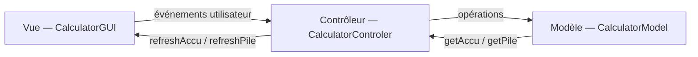

# 🔢 Calculatrice RPN — JavaFX

Une calculatrice en **Notation Polonaise Inverse** (RPN) développée en Java avec **JavaFX**, suivant l'architecture **MVC**.

> **Projet réalisé par** Noam GREA & Romain SEBIRE — IMT Mines Alès

---

## 📖 Description

Cette calculatrice fonctionne selon le principe de la **Notation Polonaise Inverse** (Reverse Polish Notation), similaire aux calculatrices HP. L'utilisateur saisit d'abord les opérandes, puis applique les opérateurs. Les valeurs sont gérées via une **pile** (stack).

### Fonctionnalités

| Fonction | Bouton | Clavier | Description |
|----------|--------|---------|-------------|
| Chiffres | `0`-`9`, `.` | `0`-`9`, `.` | Saisie dans l'accumulateur |
| Push | `push` | `P` | Empile la valeur de l'accumulateur |
| Addition | `+` | `+` | Dépile deux valeurs, empile la somme |
| Soustraction | `-` | `-` | Dépile deux valeurs, empile la différence |
| Multiplication | `x` | `*` | Dépile deux valeurs, empile le produit |
| Division | `/` | `/` | Dépile deux valeurs, empile le quotient (protection division par zéro) |
| Opposé | `+/-` | `O` | Inverse le signe du sommet de pile |
| Swap | `swap` | `S` | Échange les deux éléments du sommet |
| Drop | `drop` | `D` | Supprime le sommet de pile |
| Clear | `C` | `C` | Vide la pile et l'accumulateur |
| Retour arrière | `⌫` | `Backspace` | Supprime le dernier caractère saisi |

### Exemple d'utilisation

Pour calculer `(3 + 4) × 2` :
1. Tapez `3`, appuyez sur `push`
2. Tapez `4`, appuyez sur `+` → La pile affiche `7.0`
3. Tapez `2`, appuyez sur `x` → La pile affiche `14.0`

---

## 🏗️ Architecture MVC

```
src/
├── module-info.java                          # Module JPMS
├── application/
│   └── Main.java                             # Point d'entrée JavaFX
├── model/
│   ├── CalculatorModelInterface.java         # Interface du modèle
│   └── CalculatorModel.java                  # Logique métier (pile + accumulateur)
├── view/
│   ├── CalculatorGUIInterface.java           # Interface de la vue
│   └── CalculatorGUI.java                    # Interface graphique JavaFX
└── controller/
    ├── CalculatorControlerInterface.java      # Interface du contrôleur
    └── CalculatorControler.java               # Gestion des événements
```



- **Modèle** : Logique pure — gère l'accumulateur (`String`) et la pile (`Stack<Double>`). Aucune dépendance UI.
- **Vue** : Interface JavaFX — boutons, labels, mise en page avec `GridPane`. Délègue tous les événements au contrôleur.
- **Contrôleur** : Pont entre vue et modèle. Gère les clics boutons (`ActionEvent`) et les entrées clavier (`KeyEvent`).

Chaque couche est abstraite par une **interface** Java pour un couplage faible.

---

## 🛠️ Technologies

| Composant | Technologie |
|-----------|-------------|
| Langage | **Java 21+** |
| Interface graphique | **JavaFX** (`javafx.controls`, `javafx.graphics`) |
| Mise en page | `GridPane` avec style CSS inline |
| Système de modules | **JPMS** (`module-info.java`) |
| Pattern | **MVC** avec interfaces |

---

## 🚀 Prérequis & Exécution

### Prérequis

- **Java JDK 21+** (utilise `SequencedCollection.getLast()`)
- **JavaFX SDK 21+** (séparé du JDK depuis Java 11)

### Exécution

```bash
# Télécharger JavaFX SDK depuis https://openjfx.io/

# Compiler
javac --module-path /path/to/javafx-sdk/lib \
      --add-modules javafx.controls,javafx.graphics \
      -d out $(find src -name "*.java")

# Exécuter
java --module-path /path/to/javafx-sdk/lib \
     --add-modules javafx.controls,javafx.graphics \
     -cp out application.Main
```

Ou via **Eclipse** avec le plugin **e(fx)clipse** : ouvrir le projet et exécuter `Main.java`.

---

## 🎨 Interface

L'interface présente :
- Un **écran noir** avec affichage des 4 derniers éléments de la pile en blanc
- L'**accumulateur** (valeur en cours de saisie) en gris
- Des **boutons colorés** : opérations en orange, chiffres en gris
- Support complet du **clavier** pour une utilisation rapide

---

## 📚 Concepts Java démontrés

- Architecture **MVC** avec séparation stricte des responsabilités
- **Interfaces Java** pour l'abstraction des couches
- **JavaFX** : `Application`, `Stage`, `Scene`, `GridPane`, `Button`, `Label`
- **Gestion d'événements** : `EventHandler<ActionEvent>`, `KeyEvent`
- **Generics** : `Stack<Double>`
- **Système de modules JPMS** (`module-info.java`)
- Pattern **Observer** implicite (contrôleur rafraîchit la vue après chaque opération)
- **Notation Polonaise Inverse** — structure de données pile (LIFO)

---

## 📝 Licence

Projet académique — IMT Mines Alès.
