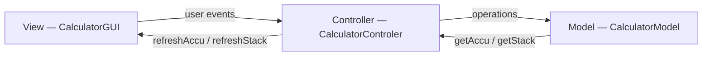

# RPN Calculator — JavaFX

A **Reverse Polish Notation** (RPN) calculator built in Java with **JavaFX**, following the **MVC** architecture pattern.

> **Built by** Noam GREA & Romain SEBIRE — IMT Mines Alès

---

## Demo Video

https://github.com/user-attachments/assets/3f1e05e4-285f-41ec-8995-93b09673e9c2

---

## Description

This calculator uses **Reverse Polish Notation** (postfix notation), similar to HP calculators. Users enter operands first, then apply operators. Values are managed through a **stack** (LIFO data structure).

### Features

| Function | Button | Keyboard | Description |
|----------|--------|----------|-------------|
| Digits | `0`-`9`, `.` | `0`-`9`, `.` | Input into the accumulator |
| Push | `push` | `P` | Pushes accumulator value onto the stack |
| Addition | `+` | `+` | Pops two values, pushes the sum |
| Subtraction | `-` | `-` | Pops two values, pushes the difference |
| Multiplication | `x` | `*` | Pops two values, pushes the product |
| Division | `/` | `/` | Pops two values, pushes the quotient (divide-by-zero protection) |
| Opposite | `+/-` | `O` | Negates the top of stack |
| Swap | `swap` | `S` | Swaps the two top stack elements |
| Drop | `drop` | `D` | Removes the top stack element |
| Clear | `C` | `C` | Clears both stack and accumulator |
| Backspace | `⌫` | `Backspace` | Removes the last typed character |

### Usage Example

To compute `(3 + 4) × 2`:
1. Type `3`, press `push`
2. Type `4`, press `+` → Stack shows `7.0`
3. Type `2`, press `x` → Stack shows `14.0`

---

## MVC Architecture

```
src/
├── module-info.java                          # JPMS module descriptor
├── application/
│   └── Main.java                             # JavaFX entry point
├── model/
│   ├── CalculatorModelInterface.java         # Model interface
│   └── CalculatorModel.java                  # Business logic (stack + accumulator)
├── view/
│   ├── CalculatorGUIInterface.java           # View interface
│   └── CalculatorGUI.java                    # JavaFX graphical interface
└── controller/
    ├── CalculatorControlerInterface.java      # Controller interface
    └── CalculatorControler.java               # Event handling
```



- **Model**: Pure business logic — manages the accumulator (`String`) and the stack (`Stack<Double>`). No UI dependencies.
- **View**: JavaFX UI — buttons, labels, layout with `GridPane`. Delegates all events to the controller.
- **Controller**: Bridge between view and model. Handles button clicks (`ActionEvent`) and keyboard input (`KeyEvent`).

Each layer is abstracted by a Java **interface** for loose coupling.

---

## Technologies

| Component | Technology |
|-----------|------------|
| Language | **Java 21+** |
| GUI framework | **JavaFX** (`javafx.controls`, `javafx.graphics`) |
| Layout | `GridPane` with inline CSS styling |
| Module system | **JPMS** (`module-info.java`) |
| Pattern | **MVC** with interfaces |

---

## Prerequisites & Running

### Prerequisites

- **Java JDK 21+** (uses `SequencedCollection.getLast()`)
- **JavaFX SDK 21+** (separate from JDK since Java 11)

### Running

```bash
# Download JavaFX SDK from https://openjfx.io/

# Compile
javac --module-path /path/to/javafx-sdk/lib \
      --add-modules javafx.controls,javafx.graphics \
      -d out $(find src -name "*.java")

# Run
java --module-path /path/to/javafx-sdk/lib \
     --add-modules javafx.controls,javafx.graphics \
     -cp out application.Main
```

Or via **Eclipse** with the **e(fx)clipse** plugin: open the project and run `Main.java`.

---

## Interface

The interface features:
- A **black screen** displaying the 4 most recent stack elements in white
- The **accumulator** (current input) in gray
- **Colored buttons**: operations in orange, digits in gray
- Full **keyboard support** for fast usage

---

## Java Concepts Demonstrated

- **MVC** architecture with strict separation of concerns
- **Java interfaces** for layer abstraction
- **JavaFX**: `Application`, `Stage`, `Scene`, `GridPane`, `Button`, `Label`
- **Event handling**: `EventHandler<ActionEvent>`, `KeyEvent`
- **Generics**: `Stack<Double>`
- **JPMS module system** (`module-info.java`)
- Implicit **Observer pattern** (controller refreshes view after each operation)
- **Reverse Polish Notation** — stack (LIFO) data structure

---

## License

Academic project — IMT Mines Alès.
